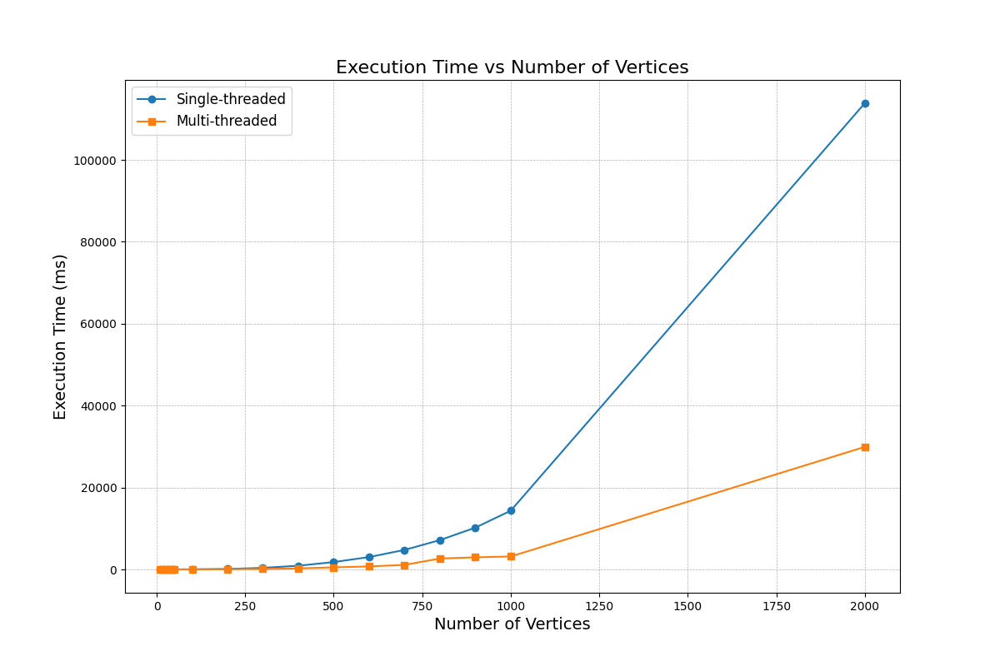

# Semester Project Goal

The goal of the semester project is to implement the **Floyd-Warshall** algorithm for finding the shortest paths between all pairs of vertices in a graph using the **C++** programming language.

The project includes:
- Creation of **single-threaded** and **multi-threaded** versions of this algorithm.
- **Comparison of both implementations** in terms of performance.
- The ability to switch between implementations via a command-line switch.

**Requirements:**
- The multi-threaded implementation must achieve **higher speed** than the single-threaded version.
- The program must pass checks using tools like **Valgrind** and **Helgrind**, ensuring proper memory management and the absence of race conditions.
- The program must be **portable across different architectures and operating systems**, without using language extensions supported only by certain compilers, or directly using the **WINAPI** and **POSIX** interfaces, except for linking the **pthread** library.

### Program Features:
- The program provides a **non-interactive interface** that accepts inputs:
    - From the command line.
    - From a file.
    - From standard input.

- Implementation of the **--help** switch, which displays usage instructions and exits the program.
- The program **does not accept unknown switches**, and in the case of an unknown switch, it displays an error message.

### Comparison of Implementations:
- The results of comparing both implementations are shown in a **graph**, which illustrates performance differences for various input data sizes. This graph allows for a **visual comparison of the efficiency** of the single-threaded and multi-threaded versions of the **Floyd-Warshall** algorithm.

---

## Summary of Key Points:

- **Implementation of the Floyd-Warshall algorithm** in **C++** in two versions: **single-threaded** and **multi-threaded**.
- **Performance comparison** of both implementations using a command-line switch.
- The **multi-threaded version** must be **faster** than the single-threaded version.
- **Code quality checks** using **Valgrind** and **Helgrind**.
- **Portability of the program** across different architectures and operating systems.
- **Non-interactive user interface** with support for the **--help** switch and error reporting for unknown switches.
- **Visualization of results** through a graph for easy performance comparison.

---

## IMPORTANT INFORMATION:
**Note**: The application displays data about paths between every pair of vertices, the original matrix, and the matrix after the algorithm is executed **only for graphs with fewer than 20 vertices**, because for graphs with more than 20 vertices, the matrices and paths between vertices become **unreadable**.

The graphs were generated using a script generator in **Python**, which is located in the folder containing all the graphs. To run the application, you need to **move the file `graph1.txt`** to the `c-make-build` folder!

---

## MEASUREMENT:
**The measurements were conducted on an AMD Ryzen 5 7535HS processor** with **Radeon Graphics** running at **3.30 GHz**, with **6 cores and 12 threads**. I used graphs with different numbers of vertices. For each algorithm, I used one graph and compared how long the single-threaded and multi-threaded algorithms took to execute.

Below is the **graph comparing execution times**:

**The graph was created using the Matplotlib and Pandas libraries.**

### Results Table:

| Vertices | Single-thread (ms) | Multi-thread (ms) |
|----------|---------------------|-------------------|
| 10       | 0                   | 2                 |
| 20       | 0                   | 3                 |
| 30       | 0                   | 5                 |
| 40       | 1                   | 8                 |
| 50       | 1                   | 9                 |
| 100      | 14                  | 21                |
| 200      | 114                 | 54                |
| 300      | 385                 | 122               |
| 400      | 905                 | 247               |
| 500      | 1796                | 507               |
| 600      | 3020                | 735               |
| 700      | 4766                | 1112              |
| 800      | 7164                | 2657              |
| 900      | 10203               | 2958              |
| 1000     | 14334               | 3159              |
| 2000     | 113828              | 29919             |

